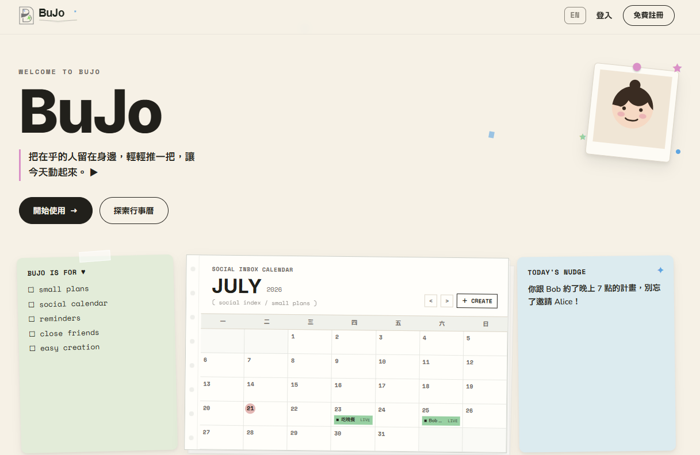

# BuJo 不揪喔~說完你就揪到了!

正式網域：[https://bujo.live](https://bujo.live)



## 關於 BuJo

BuJo 是一個「好友揪團活動規劃」平台，核心理念是為了解決好朋友們約出去玩時間難喬的問題。

## 如何開始

BuJo 圍繞五大核心功能設計，登入後即可依序體驗：

1. 行事曆：一眼看清所有揪團活動。
2. 活動："日期x時間"組成四種情境來建立活動，與朋友一起分享愉快時光。
3. 好友：透過BuJo ID增加好友，認識朋友的朋友!
4. 通知：站內通知提醒你準時參加活動！
5. 站外通知：BuJo Line官方帳號，讓你不會錯過每一個朋友的活動。

## BuJo Line 官方帳號

[https://line.me/R/ti/p/@626mzgfu?ts=07131855&oat_content=url](https://line.me/R/ti/p/@626mzgfu?ts=07131855&oat_content=url)

## BuJo（前端）

本 repo 為前端(Vue 3 + Vite)，透過 Vue Router 劃分行事曆、活動、好友、通知等頁面，需搭配後端 [BuJoBackend](https://github.com/JoMeetFriend/BuJoBackend)(Node.js + Express + Prisma + PostgreSQL)，取得資料，同時整合 Google 與 LINE 第三方登入、LINE 官方帳號活動提醒。

## 技術棧

- Vue 3 + Vite
- Pinia（狀態管理）
- Vue Router
- Tailwind CSS
- Vue I18n（多語系，繁中／英文）
- Driver.js（新手導覽）
- Vitest（測試）
- ESLint + oxlint + Prettier（程式碼風格）

## 環境需求

- Node.js `^20.19.0` 或 `>=22.12.0`

## 環境變數

複製 `.env.example` 建立 `.env.local`（本地開發用，已加入 `.gitignore` 不會被 commit）：

```
VITE_API_URL=            # 後端 API 網址，本地開發填 http://localhost:3000
VITE_LINE_OFFICIAL_ACCOUNT_ADD_FRIEND_URL= # LINE 官方帳號公開 add friend URL
VITE_LINE_OFFICIAL_ACCOUNT_QR_CODE_URL=    # LINE 官方帳號公開 QR Code 圖片 URL
```

Vite 讀取順序為 `.env.local` > `.env`，因此本地開發會自動使用 `.env.local` 的設定，部署環境則使用 `.env`，不需要手動切換。

`VITE_LINE_OFFICIAL_ACCOUNT_ADD_FRIEND_URL` 與
`VITE_LINE_OFFICIAL_ACCOUNT_QR_CODE_URL` 只用來在登入後引導與個人設定頁顯示公開的加入好友入口。兩者可以從 LINE Official Account Manager 或 LINE Developers Console 取得。QR Code 圖片網址未設定時會改用專案內建的官方 QR Code；加入好友網址未設定時不會產生空連結，仍可透過 QR Code 加入。

所有 `VITE_` 變數都會被打包到瀏覽器端，**禁止**放入 LINE Messaging API channel access token、LINE Channel Secret、OAuth Client Secret 或其他機密。`LINE_MESSAGING_CHANNEL_ACCESS_TOKEN` 與 `LINE_PUSH_ENABLED` 僅能設定在 BuJoBackend。

## 認證方式

- **本地帳號密碼**：註冊/登入走後端 API
- **Google 登入**：OAuth 與 callback 都在後端處理，前端只是 `window.location.href` 導頁到後端入口，不需要任何前端環境變數
- **LINE 登入**：OAuth 與 callback 都在後端處理；前端的兩個 LINE 官方帳號環境變數只負責顯示公開 add friend 入口，不參與登入或推播授權

若要在本地測試 OAuth 登入，需確認 Google Cloud Console / LINE Developers 後台的 redirect URI 有指向本機網址。

## 安裝與啟動

```sh
npm install
npm run dev
```

### 建置

```sh
npm run build
```

### 測試

```sh
npm run test        # watch 模式
npm run test:run    # 單次執行
```

### Lint / Format

```sh
npm run lint
npm run format
```

## 部署

**正式環境（`main`）**

- 前端：[https://bujo.live](https://bujo.live)
- 後端：[https://api.bujo.live](https://api.bujo.live)

**測試環境（`dev`）**

- 前端：[https://bu-jo-inky.vercel.app](https://bu-jo-inky.vercel.app)
- 後端：[https://bujobackend-gnfd.onrender.com](https://bujobackend-gnfd.onrender.com)

合併進 `main` 分支會自動部署到正式網址；合併進 `dev` 分支會自動部署到測試網址，方便 demo。

部署 LINE 官方帳號引導前，請確認：

- 前端部署環境已設定真實 add friend URL 與 QR Code 圖片 URL。
- 手機可由 add friend URL 開啟正確的 BuJo 官方帳號。
- 桌機可顯示 QR Code，且使用手機 LINE 掃描後開啟同一個官方帳號。
- BuJoBackend 已另外設定 Messaging API token 與 push feature flag；前端不得持有這些值。

## API 手冊

互動式 Swagger 文件（依程式碼 JSDoc 註解自動產生，可直接在頁面上 Try it out）：

- 本地：[http://localhost:3000/api-docs](http://localhost:3000/api-docs)
- 正式環境（main）：[https://api.bujo.live/api-docs](https://api.bujo.live/api-docs)
- 測試環境（dev）：[https://bujobackend-gnfd.onrender.com/api-docs](https://bujobackend-gnfd.onrender.com/api-docs)

## 相關 Repo

- 後端：[BuJoBackend](https://github.com/JoMeetFriend/BuJoBackend)

### 使用 Docker 本地建置與運行

由於專案採用 Vite，環境變數必須在**建置階段（Build Time）**寫入。打包時請務必帶入 `--build-arg`，否則會預設連至 localhost：

```sh
docker build \
  --build-arg VITE_API_URL=https://your-backend-api.com\
  --build-arg VITE_GOOGLE_CLIENT_ID=your-google-id \
  -t bujo-frontend .
```

## 開發團隊

- [劉巧文](https://github.com/LiuChiaoWen)
  - 一般註冊/登入 前後端串接
  - 資料庫 Schema 設計
  - 後端架構與開發
  - 測試版本 前後端部署
  - landing-page 製作
  - 揪團建立活動功能協作開發

- [蔣德勳](https://github.com/TE-HSIUN)
  - 個人編輯頁面切版
  - 通知頁面切版
  - line 登入/前後端串接
  - 站內通知系統
  - line 通知系統串接
  - 後端部署

- [陳姵君](https://github.com/cc-chuni)
  - 行事曆頁面切版
  - Google 登入/前後端串接
  - 活動狀態機規劃
  - 建立活動全端功能
  - 報名活動全端功能
  - 使用流程/視覺規劃

- [廖家瑜](https://github.com/yuaangela)
  - 活動頁面與動態彈窗切版
  - 前端路由與頁面切換
  - 萬用路由與前端多語系
  - 好友功能/前後端串接
  - 個人編輯名稱與簡介
  - 前端部署
